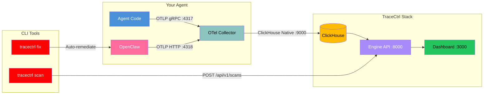

<Info>
  **Duration**: 1.5–2 hours | **Level**: Intermediate | **Format**: Hands-on lab
</Info>

---

# Part 1: Introduction to TraceCtrl

## What is TraceCtrl?

TraceCtrl is a **security observability platform for agentic AI**. Our tagline captures the workflow:

1. **See** — Visualize your agent's architecture, topology, and risk posture at a glance
2. **Trace** — Trace every message, tool call, and model request through the full execution lifecycle
3. **Ctrl** — Control and harden your agent's configuration with automated scanning and remediation

## Components

TraceCtrl has five components:

| Component | What it does | Technology |
|-----------|-------------|------------|
| **CLI** | `tracectrl scan`, `fix`, `doctor`, `setup` | Python (pip installable) |
| **Scanner** | 33 security/ops/perf/compliance checks for OpenClaw | Python |
| **OTel Collector** | Receives spans from agents via OTLP | OpenTelemetry Collector |
| **Engine** | Processes spans, builds topology, serves API | FastAPI + ClickHouse |
| **Dashboard** | Visualizes scans, traces, topology | React + Vite + Cytoscape.js |

## Architecture



**How data flows:**

1. Your agent (or OpenClaw) exports OpenTelemetry spans to the **OTel Collector**
2. The Collector writes spans to **ClickHouse** (column-oriented database optimized for traces)
3. The **Engine** runs a pipeline every 60 seconds — reads new spans, builds agent inventory, discovers topology edges
4. The **Dashboard** queries the Engine API to render trace trees, topology graphs, and scan reports
5. The **CLI Scanner** analyzes OpenClaw config files and uploads findings to the Engine

## What the Scanner Checks

33 checks across four categories:

| Category | Checks | Examples |
|----------|--------|---------|
| **Security** (26) | Network, credentials, tools, sandbox, SSRF, auth | Gateway exposed? Plaintext API keys? Dangerous tools allowed? |
| **Operational** (2) | Model config, fallbacks | Primary model set? Fallback configured? |
| **Performance** (2) | Sub-agent limits | Timeouts configured? Concurrency bounded? |
| **Compliance** (3) | Retention, isolation, redaction | Session data purged? User contexts isolated? |

---

# Part 2: Prerequisites

Install all of the following **before** the bootcamp.

## Required Software

### Git

<Card title="Git Downloads" icon="code-branch" href="https://git-scm.com/downloads">
  Download and install Git for your platform.
</Card>

```bash
# macOS
xcode-select --install

# Ubuntu/Debian
sudo apt install git

# Verify
git --version
```

### Python 3.10+

<Card title="Python Downloads" icon="python" href="https://www.python.org/downloads/">
  Download Python 3.12+ for your platform.
</Card>

```bash
# macOS
brew install python@3.12

# Ubuntu/Debian
sudo apt install python3 python3-pip python3-venv

# Verify
python3 --version
```

### Node.js 22+

<Card title="Node.js Downloads" icon="node-js" href="https://nodejs.org/en/download">
  Download Node.js 22 LTS.
</Card>

```bash
# macOS
brew install node

# Ubuntu/Debian
curl -fsSL https://deb.nodesource.com/setup_22.x | sudo -E bash -
sudo apt install -y nodejs

# Verify
node -v && npm -v
```

### Docker Desktop

<Card title="Docker Desktop" icon="docker" href="https://www.docker.com/products/docker-desktop/">
  Download Docker Desktop for your platform.
</Card>

```bash
# macOS
brew install --cask docker

# Ubuntu
sudo apt install docker.io docker-compose-plugin
sudo usermod -aG docker $USER

# Verify
docker --version && docker compose version
```

<Warning>
  Make sure Docker Desktop is **running** before proceeding. On macOS, open it from Applications. It needs ~4 GB of RAM.
</Warning>

### OpenClaw

<Card title="OpenClaw Installation" icon="terminal" href="https://docs.openclaw.ai/install">
  Full installation guide.
</Card>

```bash
# npm (recommended)
npm install -g openclaw

# Or curl
curl -fsSL https://get.openclaw.ai | bash

# Or Homebrew (macOS)
brew install openclaw

# Verify
openclaw --version
```

### AWS CLI (for Strands section)

<Card title="AWS CLI v2" icon="aws" href="https://docs.aws.amazon.com/cli/latest/userguide/getting-started-install.html">
  Install AWS CLI v2.
</Card>

```bash
# macOS
brew install awscli

# Verify
aws --version
```

## Quick Verification

Run this to check everything:

```bash
echo "=== Bootcamp Prerequisites ==="
git --version 2>/dev/null && echo "✓ Git" || echo "✗ Git MISSING"
python3 --version 2>/dev/null && echo "✓ Python" || echo "✗ Python MISSING"
node -v 2>/dev/null && echo "✓ Node.js" || echo "✗ Node.js MISSING"
docker --version 2>/dev/null && echo "✓ Docker" || echo "✗ Docker MISSING"
openclaw --version 2>/dev/null && echo "✓ OpenClaw" || echo "✗ OpenClaw MISSING"
echo "==============================="
```

## API Keys

You'll need an **Anthropic API key** for the OpenClaw section. Ask the facilitator, or find it in the Notion document **"LLM Providers (API Keys)"**.

---

# Part 3: TraceCtrl Setup

## Clone and Install

```bash
# Clone the repository
git clone https://github.com/tracectrl/tracectrl.git
cd tracectrl

# Create a virtual environment
python3 -m venv .venv
source .venv/bin/activate

# Install the CLI and Scanner
pip install ./scanner
pip install ./sdk/tracectrl

# Verify
tracectrl version
```

## Start the Stack

```bash
tracectrl setup
```

This launches the interactive setup wizard which guides you through configuration and starts the Docker containers. Alternatively, you can start containers directly:

```bash
docker compose up -d
```

This starts four containers:

| Container | Port | Purpose |
|-----------|------|---------|
| `clickhouse` | 8123, 9000 | Span storage (ClickHouse database) |
| `otel-collector` | 4317, 4318 | Receives OpenTelemetry spans |
| `tracectrl-engine` | 8000 | Intelligence Engine (API + pipeline) |
| `tracectrl-ui` | 3000 | Dashboard (React web app) |

Wait ~30 seconds for all services to start, then verify:

```bash
tracectrl doctor
```

Expected output:

```
TraceCtrl Doctor

  Services:
    [OK]   Engine API (http://localhost:8000/api/v1/health)
    [OK]   Dashboard UI (http://localhost:3000)
    [OK]   OTel Collector (http://localhost:4318/v1/traces)

  Docker:
    [OK]   Docker is installed

  All checks passed.
```

## Open the Dashboard

Open [http://localhost:3000](http://localhost:3000) in your browser. You'll see the TraceCtrl dashboard — currently empty. We'll populate it in the next sections.

<Check>
  **Checkpoint**: `tracectrl doctor` shows all green. Dashboard loads at `localhost:3000`.
</Check>

---

# Part 4: OpenClaw Setup

## What is OpenClaw?

[OpenClaw](https://docs.openclaw.ai) is a self-hosted AI agent gateway. It connects LLMs to messaging channels (Telegram, WhatsApp, Discord, Slack, WebChat) and manages agent configuration, tool access, session state, and model routing — all from a single JSON config file.

<Card title="OpenClaw Documentation" icon="book" href="https://docs.openclaw.ai">
  Full reference: installation, configuration, plugins, channels, and tools.
</Card>

## Run the Setup Wizard

```bash
openclaw
```

The interactive wizard guides you through:

1. **Model provider** — Select **Anthropic** and enter the API key
2. **Channel** — Choose **WebChat** for the bootcamp (no external accounts needed)
3. **Identity** — Name your agent (e.g., "Bootcamp Agent")

<Info>
  **API Key**: Ask the facilitator for the Anthropic API key. It can also be found in the Notion document **"LLM Providers (API Keys)"**.
</Info>

## Understand the Configuration

After setup, your config lives at `~/.openclaw/openclaw.json`. Here are the key sections:

```json
{
  "agents": {
    "defaults": {
      "model": {
        "primary": "anthropic/claude-sonnet-4-20250514"
      }
    }
  },
  "channels": {
    "webchat": {
      "enabled": true,
      "dmPolicy": "open"
    }
  },
  "gateway": {
    "bind": "loopback",
    "port": 18789
  },
  "tools": {
    "profile": "full"
  }
}
```

| Section | What it controls |
|---------|-----------------|
| `agents.defaults.model` | Which LLM to use (primary + fallbacks) |
| `channels` | Messaging channels and their DM/group policies |
| `gateway` | Network binding, authentication, TLS |
| `tools` | Which tools the agent can access (`full`, `coding`, `messaging`, `minimal`) |
| `session` | Conversation scope (`main`, `per-peer`, `per-channel-peer`) and retention |
| `logging` | Log level (`info`, `debug`, `trace`) and sensitive data redaction |
| `diagnostics` | OpenTelemetry export for runtime traces |
| `plugins` | Which plugins are enabled (providers, channels, tools) |

<Card title="OpenClaw Configuration Reference" icon="gear" href="https://docs.openclaw.ai/gateway/configuration">
  Full configuration reference with all options.
</Card>

## Enable Diagnostics (OTEL Export)

For TraceCtrl to receive runtime traces from OpenClaw, enable the diagnostics-otel plugin.

Edit `~/.openclaw/openclaw.json` and add these sections:

```json
{
  "plugins": {
    "allow": ["diagnostics-otel"]
  },
  "diagnostics": {
    "enabled": true,
    "otel": {
      "enabled": true,
      "endpoint": "http://localhost:4318",
      "protocol": "http/protobuf",
      "serviceName": "openclaw-gateway",
      "traces": true,
      "metrics": false,
      "logs": false,
      "sampleRate": 1.0,
      "flushIntervalMs": 5000
    }
  }
}
```

Restart OpenClaw to apply:

```bash
openclaw gateway restart
```

## Test Your Agent

Open the OpenClaw Control UI at [http://localhost:18789](http://localhost:18789) and send a test message via WebChat.

If you set up Telegram, you can message your bot there instead.

<Check>
  **Checkpoint**: You can chat with your agent via WebChat or Telegram. OpenClaw is running with diagnostics enabled.
</Check>

---

# Part 5: Static Scan & Risk Topology

## Run the Scan

```bash
tracectrl scan ~/.openclaw/
```

<Note>
  If `~/.openclaw` is not your workspace path, run `openclaw configure` to find your actual workspace location, then substitute that path.
</Note>

The scanner reads your `openclaw.json`, runs **33 checks**, and uploads results to the dashboard.

Terminal output shows a severity summary, findings table, compound risk signals, and topology stats:

<Frame>
  <div style={{ background: '#0D1117', padding: '24px', borderRadius: '8px', fontFamily: 'monospace', fontSize: '13px', color: '#E0E0E0', lineHeight: '1.6' }}>
    <div style={{ marginBottom: '16px' }}>
      <span style={{ color: '#FF4D4D', fontWeight: 700 }}>CRITICAL</span>  5{'    '}
      <span style={{ color: '#FF6B35', fontWeight: 700 }}>HIGH</span>  14{'    '}
      <span style={{ color: '#FFBB00', fontWeight: 700 }}>MEDIUM</span>  14{'    '}
      <span style={{ color: '#22C55E', fontWeight: 700 }}>PASS</span>  0
    </div>
    <table style={{ width: '100%', borderCollapse: 'collapse', fontSize: '12px' }}>
      <thead>
        <tr style={{ borderBottom: '1px solid #333' }}>
          <th style={{ textAlign: 'left', padding: '6px 8px', color: '#888' }}>Check ID</th>
          <th style={{ textAlign: 'left', padding: '6px 8px', color: '#888' }}>Severity</th>
          <th style={{ textAlign: 'left', padding: '6px 8px', color: '#888' }}>Finding</th>
        </tr>
      </thead>
      <tbody>
        <tr style={{ borderBottom: '1px solid #1a1a1a' }}>
          <td style={{ padding: '6px 8px', color: '#666' }}>OC-NET-001</td>
          <td style={{ padding: '6px 8px', color: '#FF4D4D', fontWeight: 600 }}>CRITICAL</td>
          <td style={{ padding: '6px 8px' }}>Gateway bind is non-loopback — exposed to network</td>
        </tr>
        <tr style={{ borderBottom: '1px solid #1a1a1a' }}>
          <td style={{ padding: '6px 8px', color: '#666' }}>OC-SEC-001</td>
          <td style={{ padding: '6px 8px', color: '#FF4D4D', fontWeight: 600 }}>CRITICAL</td>
          <td style={{ padding: '6px 8px' }}>No auth on network-exposed gateway</td>
        </tr>
        <tr style={{ borderBottom: '1px solid #1a1a1a' }}>
          <td style={{ padding: '6px 8px', color: '#666' }}>OC-SEC-002</td>
          <td style={{ padding: '6px 8px', color: '#FF4D4D', fontWeight: 600 }}>CRITICAL</td>
          <td style={{ padding: '6px 8px' }}>Dangerous flags active: browser.ssrfPolicy...</td>
        </tr>
        <tr style={{ borderBottom: '1px solid #1a1a1a' }}>
          <td style={{ padding: '6px 8px', color: '#666' }}>OC-TOOL-001</td>
          <td style={{ padding: '6px 8px', color: '#FF4D4D', fontWeight: 600 }}>CRITICAL</td>
          <td style={{ padding: '6px 8px' }}>bash/exec tools enable arbitrary command execution</td>
        </tr>
        <tr style={{ borderBottom: '1px solid #1a1a1a' }}>
          <td style={{ padding: '6px 8px', color: '#666' }}>OC-TOOL-002</td>
          <td style={{ padding: '6px 8px', color: '#FF4D4D', fontWeight: 600 }}>CRITICAL</td>
          <td style={{ padding: '6px 8px' }}>Wildcard tool permission — all tools permitted</td>
        </tr>
        <tr style={{ borderBottom: '1px solid #1a1a1a' }}>
          <td style={{ padding: '6px 8px', color: '#666' }}>OC-CRED-001</td>
          <td style={{ padding: '6px 8px', color: '#FF6B35', fontWeight: 600 }}>HIGH</td>
          <td style={{ padding: '6px 8px' }}>Plaintext keys found at: models.providers.vllm.apiKey</td>
        </tr>
        <tr style={{ borderBottom: '1px solid #1a1a1a' }}>
          <td style={{ padding: '6px 8px', color: '#666' }}>OC-SEC-004</td>
          <td style={{ padding: '6px 8px', color: '#FF6B35', fontWeight: 600 }}>HIGH</td>
          <td style={{ padding: '6px 8px' }}>sandbox.mode is "off" — no tool isolation</td>
        </tr>
        <tr style={{ borderBottom: '1px solid #1a1a1a' }}>
          <td style={{ padding: '6px 8px', color: '#666' }}>OC-SEC-005</td>
          <td style={{ padding: '6px 8px', color: '#FF6B35', fontWeight: 600 }}>HIGH</td>
          <td style={{ padding: '6px 8px' }}>Browser SSRF: dangerouslyAllowPrivateNetwork is true</td>
        </tr>
        <tr style={{ borderBottom: '1px solid #1a1a1a' }}>
          <td style={{ padding: '6px 8px', color: '#666' }}>OC-OPS-001</td>
          <td style={{ padding: '6px 8px', color: '#FF6B35', fontWeight: 600 }}>HIGH</td>
          <td style={{ padding: '6px 8px' }}>No primary model configured</td>
        </tr>
        <tr>
          <td style={{ padding: '6px 8px', color: '#555' }} colSpan={3}>... 24 more findings (33 checks total)</td>
        </tr>
      </tbody>
    </table>
    <div style={{ marginTop: '16px', borderTop: '1px solid #333', paddingTop: '12px' }}>
      <div style={{ color: '#888', fontWeight: 600, marginBottom: '4px' }}>Compound Risk Signals</div>
      <div><span style={{ color: '#FF6B35' }}>[HIGH]</span> COMPOUND-004 Plaintext credentials + public channel = credential exfiltration risk</div>
    </div>
    <div style={{ marginTop: '12px', color: '#888' }}>
      Topology: 9 nodes · 8 edges
    </div>
  </div>
</Frame>

## View in the Dashboard

Open [http://localhost:3000/scan](http://localhost:3000/scan) to see:

1. **Severity cards** — CRITICAL / HIGH / MEDIUM / PASS counts
2. **Architecture risk topology** — your OpenClaw architecture with risk-colored nodes
3. **Category sections** — findings grouped by Security, Operational, Performance, Compliance

### Reading the Topology Graph

| Node Color | Type |
|-----------|------|
| **Teal** | Ingress channels (Telegram, WebChat) |
| **Blue** | Agents |
| **Purple** | LLM Providers (Anthropic, OpenAI) |
| **Green** | Tools |
| **Orange** | Extensions/Plugins |

Nodes with **red borders** have CRITICAL findings. **Orange borders** = HIGH. **Yellow** = MEDIUM.

### Exploring Findings

Expand each category section to see individual findings. Click any finding to see:
- **What was found** — the specific misconfiguration
- **Why it matters** — the security/operational rationale
- **How to fix it** — step-by-step remediation

## Auto-Fix Critical Findings

```bash
tracectrl fix ~/.openclaw/ --auto
```

This automatically remediates the most common findings:

| Finding | What the fix does |
|---------|------------------|
| `OC-NET-001` Gateway exposed | Sets `gateway.bind = "loopback"` |
| `OC-TOOL-001` Dangerous tools | Removes `bash`, `exec` from allow lists |
| `OC-TOOL-002` Wildcard tools | Removes `*` from tools.allow |
| `OC-ING-001` Open DM policy | Sets `dmPolicy = "pairing"` |
| `OC-PERS-001` Cron enabled | Sets `cron.enabled = false` |
| `OC-LOG-002` Debug logging | Sets `logging.level = "info"` |

The CLI creates a `.bak` backup, applies fixes, re-scans, and uploads results:

```
  ✓ OC-NET-001: Set gateway.bind = "loopback"
  ✓ OC-TOOL-002: Removed "*" from tools.allow

  Before: 12 findings → After: 6 findings
  Results uploaded to engine.
```

Refresh the dashboard to see the updated report.

## Manual Fixes

Some findings require manual remediation. Here are the most important ones:

### Plaintext API Keys (OC-CRED-001)

**Problem**: API keys stored directly in `openclaw.json`.

**Fix**: Replace with environment variable references:

```json
// Before
"apiKey": "sk-ant-abc123..."

// After
"apiKey": "${ANTHROPIC_API_KEY}"
```

Then set the variable in your shell:

```bash
export ANTHROPIC_API_KEY="sk-ant-abc123..."
```

Or use `openclaw configure` to reconfigure the provider with an env var.

### Browser SSRF Policy (OC-SEC-002)

**Problem**: `browser.ssrfPolicy.dangerouslyAllowPrivateNetwork` is `true` by default — the agent's browser can reach your internal network.

**Fix**: Add to `openclaw.json`:

```json
{
  "browser": {
    "ssrfPolicy": {
      "dangerouslyAllowPrivateNetwork": false
    }
  }
}
```

### Sandbox Not Enabled (OC-SEC-004)

**Problem**: Agent tools run directly on the host without isolation.

**Fix**:

```json
{
  "agents": {
    "defaults": {
      "sandbox": {
        "mode": "non-main"
      }
    }
  }
}
```

### Session Scope Shared (OC-COMP-002)

**Problem**: All users share the same conversation context.

**Fix**:

```json
{
  "session": {
    "dmScope": "per-channel-peer"
  }
}
```

<Card title="OpenClaw Security Guide" icon="shield" href="https://docs.openclaw.ai/gateway/security">
  Full security configuration reference.
</Card>

## Re-scan After Manual Fixes

```bash
tracectrl scan ~/.openclaw/
```

Refresh the dashboard — your findings should be significantly reduced.

<Check>
  **Checkpoint**: 0 CRITICAL findings. Dashboard shows the updated scan report with risk topology.
</Check>

---

# Part 6: Strands Agent + Runtime Telemetry

## What is Strands?

[AWS Strands](https://strandsagents.com/) is an open-source SDK for building AI agents with tool use. TraceCtrl instruments Strands agents to capture every execution — agent runs, LLM calls, and tool invocations — as OpenTelemetry spans.

## Install the Strands Instrumentation

From the TraceCtrl repo root:

```bash
pip install ./sdk/tracectrl-instrumentation-strands
pip install strands-agents strands-agents-tools
```

## Create a Strands Agent

Create a file called `my_agent.py`:

```python
import tracectrl
from tracectrl.instrumentation.strands import StrandsInstrumentor

# 1. Configure TraceCtrl — sends spans to the local OTel Collector
tracectrl.configure(service_name="bootcamp-agent")

# 2. Instrument Strands — wraps all agent/LLM/tool calls with span creation
StrandsInstrumentor().instrument()

# 3. Build your agent
from strands import Agent
from strands_tools import calculator

agent = Agent(
    model="us.anthropic.claude-sonnet-4-20250514-v1:0",
    tools=[calculator],
    system_prompt="You are a helpful assistant. Use the calculator tool for math."
)

# 4. Run it
response = agent("What is 42 * 17 + 389?")
print(response)
```

<Info>
  **API Key**: Set your credentials before running:
  ```bash
  export AWS_PROFILE=default
  # or
  export ANTHROPIC_API_KEY="sk-ant-..."
  ```
  Ask the facilitator for keys, or check the Notion document **"LLM Providers (API Keys)"**.
</Info>

## Run the Agent

```bash
python my_agent.py
```

You should see the agent respond with the calculation result.

## View the Traces

Open [http://localhost:3000/sessions](http://localhost:3000/sessions).

You'll see a new trace for `bootcamp-agent`. Click the row to expand the **trace tree**:

- **Agent span** — the top-level agent execution
- **LLM spans** — each model call with input/output and token counts
- **Tool spans** — calculator tool with arguments and result

Click any span to see its **detail panel** with timing, attributes, and input/output values.

## View the Topology

Open [http://localhost:3000/topology](http://localhost:3000/topology).

The runtime topology graph now shows:

- **Agent node** (bootcamp-agent) → connected to the **LLM provider** (Anthropic/Bedrock)
- **Agent node** → connected to **tool nodes** (calculator)

This graph is built automatically from the trace data — no configuration needed.

## Try More Complex Scenarios

### Multi-tool Agent

```python
from strands import Agent
from strands_tools import calculator, http_request

agent = Agent(
    model="us.anthropic.claude-sonnet-4-20250514-v1:0",
    tools=[calculator, http_request],
    system_prompt="You are a research assistant with calculator and web access."
)

response = agent("What is the population of Singapore divided by its area in km²?")
print(response)
```

### Multiple Runs

Run the agent several times to build up session history:

```python
questions = [
    "What is 2^10?",
    "Calculate the square root of 144",
    "What is 15% of 2500?",
]

for q in questions:
    print(f"\n> {q}")
    print(agent(q))
```

Each run creates a new session in the dashboard. The topology grows as more tools and models are observed.

## What Gets Captured

| Span Type | Key Attributes |
|-----------|---------------|
| **Agent** | `agent.name`, `openinference.span.kind=AGENT` |
| **LLM** | `llm.model_name`, `input.value`, `output.value`, token counts |
| **Tool** | `tool.name`, `tool.description`, input/output, risk category |
| **Session** | `tracectrl.session_id` linking all spans in a conversation |

TraceCtrl's `TraceCtrlSpanProcessor` automatically enriches every span with:
- **Tool risk category** — one of 8 categories (filesystem, network, code_execution, data_store, web_browsing, communication, system, other)
- **Agent identity** — framework detection and agent naming
- **Session correlation** — links all spans from a single conversation

<Check>
  **Checkpoint**: Sessions page shows traces with agent → LLM → tool spans. Topology page shows your agent connected to its tools and LLM provider.
</Check>

---

# Summary

## What You Built

| Component | Status |
|-----------|--------|
| TraceCtrl stack (Engine + Dashboard + Collector + ClickHouse) | Running via Docker |
| OpenClaw agent with WebChat | Configured and chatting |
| Security scan (33 checks) | Findings visible on dashboard |
| Auto-remediation | Critical findings fixed |
| Manual hardening | SSRF, sandbox, session isolation configured |
| Strands agent with TraceCtrl instrumentation | Traces and topology visible |

## CLI Reference

```bash
tracectrl scan [path]          # Run 33-check security scan
tracectrl fix --auto           # Auto-fix + rescan + upload
tracectrl doctor               # Verify all services are healthy
tracectrl version              # Print version
tracectrl install-plugin       # Install the OpenClaw telemetry plugin
```

## Useful Links

<CardGroup cols={2}>
  <Card title="TraceCtrl GitHub" icon="github" href="https://github.com/tracectrl/tracectrl">
    Source code and issues.
  </Card>
  <Card title="OpenClaw Docs" icon="book" href="https://docs.openclaw.ai">
    Full OpenClaw reference.
  </Card>
  <Card title="OpenTelemetry" icon="signal" href="https://opentelemetry.io">
    The observability standard TraceCtrl is built on.
  </Card>
  <Card title="Strands Agents" icon="aws" href="https://strandsagents.com">
    AWS Strands agent framework.
  </Card>
</CardGroup>
